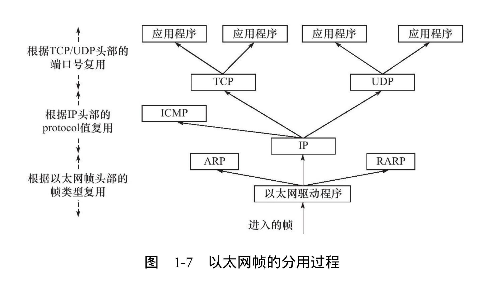
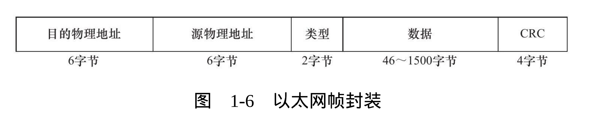
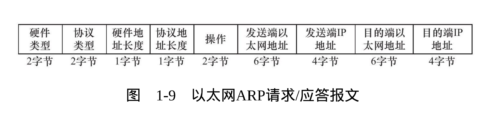

## 结构
TCP/IP协议族是一个四层协议系统， 自底向上分别是数据链路层、网络层、传输层、应用层。 

### 1. 数据链路层
实现了网卡接口的网络驱动程序， 解决了同一局域网计算机帧的传输问题， 并且隐藏了不同物理网络不同的电气特性， 为网络层提供了无差错的传输服务。 

该层的协议主要体现为ARP协议， 实现了了IP地址和MAC地址的相互转换。 （讨论ARP协议在哪一层没有意义， 重点是IP包进入链路层， 链路层会使用ARP协议添加自己的链路信息而已）

### 2. 网络层
实现了路由、转发功能，为上层提供了尽最大可能交付传输服务。

核心协议： IP协议

根据数据包的目的地址来决定如何投递它， 若不能直接交付， 则寻找合适的下一条路由
器来方法。 

另一重要协议： ICMP协议， IP协议的重要补充。

### 3. 传输层
实现了端到端的通信， 为上层提供了可靠或及时的服务。

重要协议： TCP、 UDP

TCP协议：为应用层提供了可靠的，面向连接的和基于流的服务。 

可靠： 使用超时重传、数据确认等方式来确保数据包被正确地发送到目的端

面向连接: 建立连接时系统在内核中为该链接维护必要地数据结构， 如连接状态、 读写缓冲区，及诸多定时器等。  断开连接释放内核数据。

基于流： 数据没有边界， 源源不断等从通信一段流入另一端。 

UDP协议： 不可靠、 无连接、基于数据包的服务

不可靠： 应用层自己处理数据确认、 超时重传

无连接： 每发一次数据都要明确指定接收端的地址

基于数据报： 收发都是以数据包为单位读写。 

### 4. 应用层
负责处理应用程序的逻辑。 如文件传输等等。 应用层在用户空间实现， 应用层以下则是在内核空间中实现。 

上层协议使用下层协议提供的服务方式： 封装， 每层协议都将在上层数据的基础上加上自己的头部信息， 以实现该层的功能。 

### 分用复用
不仅存在与应用程序对应的端口号。 对每一层协议都存在分用复用的实现。 

即用类型字段来标识上层对应的各协议， 以交付给系统各个模块或对应的应用程序

### 以太网帧格式

* 物理地址由6个字节标识

* 类型包括ARP, RARP, IP(0x0800)

* CRC为循环冗余校验码， 抱枕数据帧无误。

### ARP请求/应答报文格式**

* 硬件类型字段定义物理地址的类型， 值为1表示MAC地址
* 协议类型字段表示要映射的协议地址类型，值为0x0800表示IP地址
* 硬件地址类型长度字段和协议定制长度字段顾名思义为字节长度， MAC：6 IP(v4)： 4
* 操作字段： 1：ARP请求 2：ARP应答 3：RARP请求 ： RARP应答

### Socket与TCP/IP协议族的关系
Socket是一套系统调用，使得用用程序能够访问下层协议提供的服务。

功能： 
* 将应用程序数据从用户缓冲区复制到TCP/UDP内核发送缓冲区， 以交付内核发送数据； 从TCP/UDP内核接收缓冲区复制到用户缓冲区， 以读取数据。
* 应用程序可以通过SocketAPI来修改内核各层协议的头部信息或其他数据结构